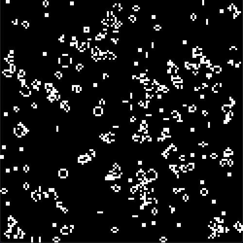

# The Conway's game of life

**author:** Pierre-Jean Pollot.

<div style="text-align:center;"></div>

## Technologies

Language C with the graphic library SDL2.

## Installation and run

In the document root, enter in the command line:

```{sh}
make
```

Then run the program by typing:

```{sh}
./golife.run [number of iterations] [time in milliseconds] [initial probability that a cell is living]
```

If none of these parameters is set, then the program **by default** will iterate `300 times` and change state each `70ms` for an initial porosity of `0.15`.

## Description

There are four types of cells:

- `Dead cells` in **black**.
- `Living cells` in **white**.
- `Newborn cells` in **green**.
- `Dying cells` in **red**.

*Newborn cells* and *Dying cells* will become respectively *Living cells* and *Dead cells* at the next step. For creating those two types of cells, *Dead cells* and *Living cells* are following the **Game of life's rules** that can be found [here](https://en.wikipedia.org/wiki/Conway%27s_Game_of_Life).

## Tinkering your own game of life

For changing the display and the grid, you can change their parameters in the file *src/properties.h*.
